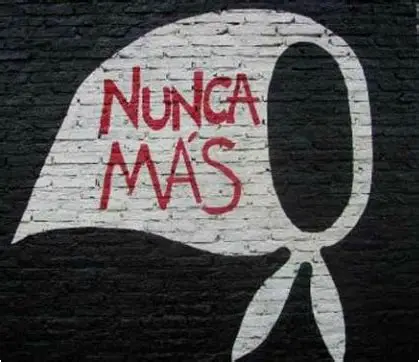

# Día de la Memoria, Verdad y Justicia

Este proyecto web conmemora el **24 de marzo**, Día Nacional de la Memoria por la Verdad y la Justicia en Argentina.  
El sitio busca mantener viva la memoria de las víctimas del terrorismo de Estado, reafirmar el compromiso con la verdad y garantizar justicia frente a los crímenes de lesa humanidad.

## 📖 Contenido

El sitio incluye:
- **Introducción**: contexto histórico del golpe de Estado de 1976.
- **Contexto geopolítico y regional**: dictaduras en América Latina y el Plan Cóndor.
- **Narrativa oficial del régimen**: discursos y propaganda de la Junta Militar.
- **Crímenes de la dictadura**: desapariciones, centros clandestinos, censura y exilios.
- **Contra la teoría de los dos demonios**: postura crítica y memoria colectiva.
- **Organismos y recursos**: enlaces a Abuelas, Madres de Plaza de Mayo, CELS y otros.
- **Madres de Plaza de Mayo**: historia de su lucha y resistencia.

## 🖼️ Características técnicas

- HTML5 y CSS3 con diseño **responsivo**.
- Uso de **Flexbox** y **Grid** para la disposición de elementos.
- Paleta de colores sobria y accesible, con contraste adecuado.
- Galería de imágenes y videos incrustados de YouTube.
- Tabla comparativa de dictaduras en América Latina.
- Navegación lateral fija (*aside*) con índice interactivo.

## 🚀 Publicación

El sitio puede visualizarse online mediante **GitHub Pages**:

1. Ir a la pestaña **Settings** del repositorio.
2. Seleccionar **Pages → Deploy from a branch**.
3. Elegir la rama `main` y carpeta `/root`.
4. Guardar los cambios.  
   GitHub generará un enlace público del estilo:  
   `https://tuusuario.github.io/Memoria-Verdad-y-Justicia/`

## 📂 Estructura del proyecto

Dia de la Memoria/
├── index.html
├── index_2.html
├── imagenes/
│   ├── logo.png
│   ├── dictadura.jpg
│   ├── madres.jpg
│   ├── madres_plaza.jpg
│   ├── centro_detencion.jpg
│   ├── fotos_desaparecidos.jpg
│   ├── nunca_mas.jpg
│   ├── videla.jpg
│   └── favicom.png          

## ✍️ Autor

Proyecto realizado por **Cristian Horacio Aquino Valdez**  
© 2026 – Inspirado en la lucha de las Madres y Abuelas de Plaza de Mayo y en el trabajo de los organismos de derechos humanos.
